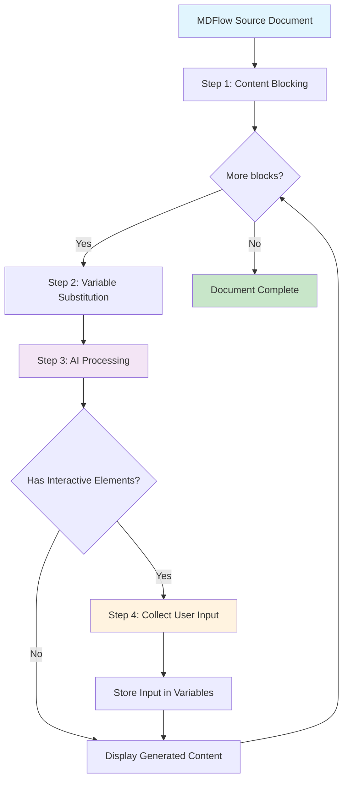

# Core Concepts

Understanding these key concepts will help you create effective MarkdownFlow documents.

## Writing for AI, Not Humans

!!! info "Paradigm Shift"
    The most important concept: your content is not directly for readers — it's prompts for AI.

This fundamental shift changes how you write everything.

### Traditional Approach (Writing for Humans)

In traditional writing, you create content that readers consume directly:

```markdown
# Python Tutorial

Python is a high-level, interpreted programming language. It was created
by Guido van Rossum and first released in 1991. Python emphasizes code
readability with its notable use of significant indentation.

## Key Features

- Easy to learn and use
- Interpreted language  
- Cross-platform compatibility
- Large standard library
```

Everyone gets the same information, regardless of their background or needs.

### MarkdownFlow Approach (Writing for AI)

In MDFlow, you write instructions for AI to create personalized content:

```markdown
# Python Tutorial

Introduce Python programming to {{user_name}}, a {{experience_level}}
programmer interested in {{goal_area}}.

- If they're a beginner: focus on simplicity and readability
- If they're experienced: emphasize Python's unique advantages
- Always connect examples to their {{goal_area}} interest

## Key Features Section

Explain Python's key features, but emphasize the ones most relevant to
{{goal_area}}:

- For web development: mention Django/Flask frameworks
- For data science: highlight NumPy/Pandas ecosystem  
- For automation: emphasize scripting capabilities
- For AI/ML: discuss TensorFlow/PyTorch integration

Use {{user_name}} in examples to make it personal.
```

This creates different tutorials for different users from the same source.

### Example Transformation

**User Input:**

- `user_name`: "Sarah"
- `experience_level`: "intermediate"
- `goal_area`: "data science"

**AI-Generated Output:**

> # Python Tutorial
>
> Hey Sarah! As someone with intermediate programming experience looking to get into data science, Python is an excellent choice. You already understand programming fundamentals, so let's focus on why Python dominates the data science world.
>
> ## Key Features for Data Science
>
> - **Rich ecosystem**: NumPy for numerical computing, Pandas for data manipulation
> - **Interpreted nature**: Perfect for exploratory data analysis in Jupyter notebooks  
> - **Simple syntax**: Less time fighting syntax, more time analyzing data
> - **Visualization libraries**: Matplotlib, Seaborn, Plotly for creating insights

The same template could generate a completely different tutorial for a beginner interested in web development.

## Document Structure

Every MarkdownFlow document has two main parts:

### Content Prompt (Main Body)

This is your main document content — all the instructions that tell the AI how to generate personalized content for readers.

```markdown
Welcome {{user_name}} to our {{course_type}} course.

Explain the benefits of this course based on their selected {{learning_goal}}:
- If "career advancement": focus on job market value
- If "personal interest": emphasize enjoyment and fulfillment
- If "skill upgrade": highlight practical applications

Create an encouraging introduction that makes {{user_name}} excited to start.
```

### Document Prompt (Global Instructions)

Optional instructions that guide the AI's overall behavior for the entire document. These act like "system settings" for how content should be generated.

```markdown
---
Language: Adapt to {{browser_language}}
Tone: Professional but friendly
Style: Clear and concise
Personalization: Adjust complexity based on {{experience_level}}
Format: Use examples relevant to {{industry_background}}
Constraints: Keep sections under 150 words unless detail requested
---
```

Readers never see the document prompt — they only see the AI-generated results.

## Processing Workflow

Here's how your MDFlow source becomes personalized content:



### Step 1: Content Blocking

The MDFlow Agent divides your content into logical blocks for processing.

### Step 2: Variable Substitution  

Variables like `{{user_name}}` are replaced with actual values. Unassigned variables become "UNKNOWN".

### Step 3: AI Processing

Each block is sent to the AI with your document prompt as system instructions.

### Step 4: Interactive Elements

If the block contains buttons or inputs, the system pauses to collect user responses.

### Step 5: Continue (Iterate)

The process repeats for each block until the entire document is processed.

**For detailed technical information:** [How It Works Specification](../specification/how-it-works.md)

## Key Benefits of This Approach

### For Content Creators

- **Write once, serve many**: One template adapts to countless user scenarios
- **Higher engagement**: Personalized content keeps users interested
- **Scalable personalization**: No need to manually create versions for different audiences

### For Users  

- **Relevant content**: Information tailored to their specific needs and context
- **Interactive experience**: Active participation instead of passive reading
- **Efficient learning**: Skip irrelevant details, focus on what matters to them

### For Organizations

- **Cost effective**: Maintain one source document instead of many variations
- **Consistent messaging**: Core information stays accurate while presentation adapts
- **Data insights**: Learn about user preferences through their choices

## Best Practices

### 1. Think in Instructions, Not Information

Ask yourself: "How should the AI explain this?" rather than "What should I explain?"

### 2. Embrace Conditional Logic

Use if/then thinking to create branching content paths based on user input.

### 3. Make Variables Meaningful

Choose variable names that clearly indicate what information they store.

### 4. Test Different User Paths

Consider how your content will work for different combinations of user inputs.

### 5. Balance Personalization and Consistency

Personalize the presentation, but keep core facts and key messages consistent.

## What's Next?

Now that you understand the core concepts, let's put them into practice:

**[Your First MarkdownFlow →](first-mdflow.md)**

Build your first interactive document and see these concepts in action.
