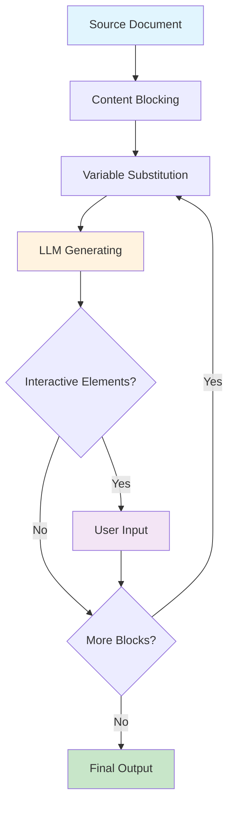

---
tags:
  - Core Concepts
  - Processing
  - Workflow
  - AI
---

# How It Works

MarkdownFlow transforms source documents into personalized, interactive pages through a sophisticated processing pipeline. Understanding this workflow helps you write more effective MarkdownFlow documents.

## Writing for AI, Not Humans

!!! info "Core Principle"
    The content you write is not directly for readers — it's prompts for AI.

This paradigm shift is crucial for creating effective MarkdownFlow documents.

### A Simple Example

Consider these two approaches to the same content:

**Traditional (Writing for Humans):**

```markdown
Python is a high-level, interpreted programming language known for its simplicity and readability.
```

**MarkdownFlow (Writing for AI):**

```markdown
Explain Python to a {{level}} programmer who is interested in {{use_case}}, emphasizing aspects most relevant to their background.
```

The MarkdownFlow version doesn't tell readers about Python directly. Instead, it instructs the AI how to generate personalized explanations. A beginner interested in web development might receive:

> Python is like writing instructions in plain English—perfect for building your first website with frameworks like Django.

While an advanced programmer interested in data science might get:

> Python's extensive scientific computing ecosystem with NumPy and Pandas makes it the de facto standard for data analysis and machine learning.

This is the essence of MarkdownFlow: **write prompts that guide AI to create content**, rather than writing the content itself.

## Document Structure

A MarkdownFlow source document consists of two main parts: content prompt and document prompt.

For those familiar with LLMs: the document prompt acts as the system prompt, while the content prompt acts as the user prompt.

### 1. Content Prompt

The main body of your document. All the content will be transformed by the MarkdownFlow agent.

### 2. Document Prompt

Instructions that guide how the content source should be transformed by the MarkdownFlow Agent. Readers never see the document prompt itself — they only see the AI-generated results based on content source.

While optional, document prompts are highly recommended as they provide global control over the entire document's rendering. Use them for:

- **Output Format**: Specify language, tone, and writing style
- **Personalization Rules**: Define how content adapts to different user types
- **Content Guidelines**: Set boundaries and requirements for generated content
- **Global Variables**: Establish document-wide parameters

Example document prompt:

```markdown
Language: Adapt to {{browser_language}}
Tone: Professional but friendly
Style: Clear and concise
Personalization: Adjust complexity based on {{level}}
Format: Use examples relevant to {{industry}}
Constraints: Keep explanations under 100 words unless detail is requested
```

## Processing Workflow

Here's how MarkdownFlow transforms your source into the final output:



### Step 1: Content Blocking

For better processing effectiveness, the MarkdownFlow Agent divides the content prompt into several blocks. The first block is processed first.

### Step 2: Variable Substitution

Variables in the current block are replaced with concrete values. Unassigned variables are replaced with "UNKNOWN".

For more details, see the [Variables](variables.md) section.

### Step 3: LLM Generating

The document prompt and the current content block are sent to the Large Language Model. The LLM outputs transformed content still in MarkdownFlow format.

### Step 4: Interactive Element Processing

If the current block contains buttons or inputs, the system displays the interactive interface and waits for user input. The input result is stored in variables.

For more details, see the [Button/Input](button-input.md) sections.

### Step 5: Iterate

Return to Step 2 to process the next block. This continues until all blocks are processed.
