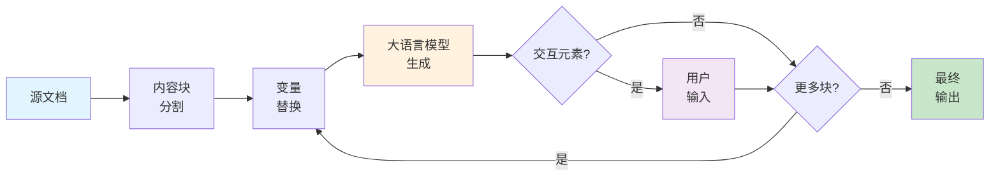

---
tags:
  - 核心概念
  - 处理
  - 工作流程
  - AI
---

# 工作原理

MarkdownFlow 通过复杂的处理管道将源文档转换为个性化的交互式页面。理解这个工作流程有助于您编写更有效的 MarkdownFlow 文档。

## 为 AI 写提示词，而非为人类写内容

!!! info "核心原则"
    您编写的内容不是直接面向读者的——而是 AI 的提示词。

这种思维转变对于创建有效的 MarkdownFlow 文档至关重要。

### 简单示例

考虑这两种处理相同内容的方法：

**传统方式（为人类写作）：**

```markdown
Python 是一种以简洁和可读性著称的高级解释型编程语言。
```

**MarkdownFlow（为 AI 写作）：**

```markdown
向一位对 {{use_case}} 感兴趣的 {{level}} 程序员解释 Python，重点强调与他们背景最相关的方面。
```

MarkdownFlow 版本不直接告诉读者关于 Python 的信息。相反，它指导 AI 如何生成个性化解释。对网页开发感兴趣的初学者可能会收到：

> Python 就像用简单英语写指令——非常适合使用 Django 等框架构建您的第一个网站。

而对数据科学感兴趣的高级程序员可能会得到：

> Python 拥有包含 NumPy 和 Pandas 的广泛科学计算生态系统，使其成为数据分析和机器学习的事实标准。

这就是 MarkdownFlow 的精髓：**编写指导 AI 创建内容的提示词**，而不是编写内容本身。

## 文档结构

MarkdownFlow 源文档由两个主要部分组成：内容提示词和文档提示词。

对于熟悉大语言模型的人：文档提示词充当系统提示词，而内容提示词充当用户提示词。

### 1. 内容提示词

您文档的主体。所有内容都将由 MarkdownFlow 智能体转换。

### 2. 文档提示词

指导内容源应如何被 MarkdownFlow 智能体转换的指令。读者从不直接看到文档提示词——他们只看到基于内容源的 AI 生成结果。

虽然是可选的，但强烈建议使用文档提示词，因为它们提供对整个文档渲染的全局控制。用于：

- **输出格式**：指定语言、语气和写作风格
- **个性化规则**：定义内容如何适应不同用户类型
- **内容指南**：为生成的内容设置边界和要求
- **全局变量**：建立文档范围的参数

文档提示词示例：

```markdown
语言：适应 {{browser_language}}
语气：专业但友好
风格：清晰简洁
个性化：根据 {{level}} 调整复杂度
格式：使用与 {{industry}} 相关的示例
约束：除非要求详情，否则保持解释在100字以内
```

## 处理工作流程

以下是 MarkdownFlow 如何将您的源文档转换为最终输出：



### 步骤1：内容块分割

为了更好的处理效果，MarkdownFlow 智能体将内容提示词分为几个块。首先处理第一个块。

### 步骤2：变量替换

当前块中的变量被具体值替换。未分配的变量被替换为"UNKNOWN"。

更多详情请参见[变量](variables.md)部分。

### 步骤3：大语言模型生成

文档提示词和当前内容块被发送到大语言模型。大语言模型输出仍为 MarkdownFlow 格式的转换后内容。

### 步骤4：交互元素处理

如果当前块包含按钮或输入框，系统显示交互界面并等待用户输入。输入结果存储在变量中。

更多详情请参见[交互](interaction.md)部分。

### 步骤5：迭代

返回步骤2处理下一个块。这会持续直到所有块都被处理完毕。
